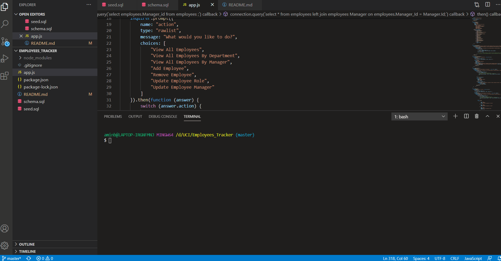

# Employees_Tracker
## Description
an application that navigates through the different departments and positions of a business and allow user to delete ,add and update employees.
## Technologies used
* [MySQL](#MySQL)
* [NODEJS](#NODEJS)
* [JAVASCRIPT](#JAVASCRIPT)
* [EXPRESS](#EXPRESS)
## Installation
npm intall
## Usage
node app.js
## badges
 

#### URL Github Repo:
https://aminbouzouita.github.io/Employees_Tracker/

#### Screenshot
.png)
.png)
#### App Demo

---
© 2020 Amin Bouzouita.
